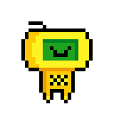
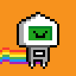
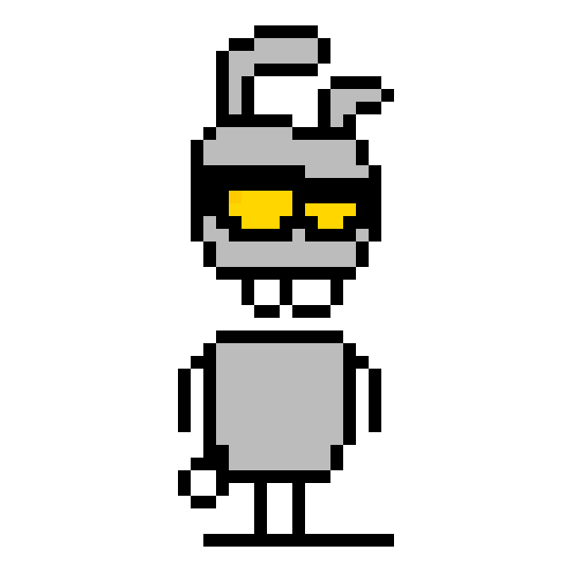
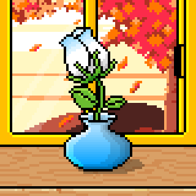
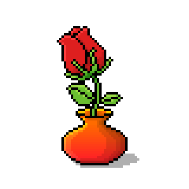

# Bitcoin (Inscription) Generative Image Machinery

bitgen - bitcoin (inscription) generative image machinery incl gen-brc721 & co


* home  :: [github.com/ordbase/ordbase](https://github.com/ordbase/ordbase)
* bugs  :: [github.com/ordbase/ordbase/issues](https://github.com/ordbase/ordbase/issues)
* gem   :: [rubygems.org/gems/bitgen](https://rubygems.org/gems/bitgen)
* rdoc  :: [rubydoc.info/gems/bitgen](http://rubydoc.info/gems/bitgen)


##  Usage

### Generative BRC-721 (Gen BRC-721 or GBRC-721)

(historic) ordinal (bitcoin) protocol by [Jerry Fanelli](https://github.com/jerryfane) proposed / published in mid-May 2023

- Generative BRC-721 Proposol - <https://github.com/jerryfane/generative-brc-721>
- Analytics (Dune) Dashboard -  <https://dune.com/j543/generative-brc-721>


note:  Gen BRC-721 is ded. Jerry Fanelli proposed BRC-69 as
the official successor in July 2023
BUT yes, [Ordgen / ORC-721](https://github.com/ordbase/generative-orc-721) may be the better (generative) alternative protocol / winner.


Let's try some (historic) Gen BRC-721 collections...


#### Collection №1 - 1000 Ordibots (32x32px)

_The world's first gen-brc-721_

Find the deploy text @ [inscription no 8326719](https://ordinals.com/inscription/b7205d40f3b1b1486567f0d6e53ff2812983db4c03ad7d3606812cd150c64802i0) - May 21, 2023 by Jerry Fanelli.


Let's generate some ulta-rare never-before-seen (do-it-yourself) ordibots.

``` ruby
require 'bitgen'

## step 1: read in the deploy text (incl the base64-encoded generative images)
gen = Bitgen::Generator.read( './ordibots.json' )


## step 2:  generate your images
bot = gen.generate( accessories: 'antenna',
                    body: 'gold-oval',
                    belly: 'chess',
                    face: 'happy',
                  )

bot.save( "./bot1.png" )
bot.zoom( 4 ).save( "./bot1@4x.png" )


bot = gen.generate( background: 'bitcoin-orange',
                    accessories: 'rainbow',
                    body: 'standard-square',
                    belly: 'empty',
                    face: 'unimpressed'
                  )

bot.save( "./bot2.png" )
bot.zoom( 4 ).save( "./bot2@4x.png" )


bot = gen.generate( background: 'bitcoin-orange',
                    accessories: 'rainbow',
                    body: 'black-and-white-triangular',
                    belly: 'square',
                    face: 'happy'
                  )

bot.save( "./bot3.png" )
bot.zoom( 4 ).save( "./bot3@4x.png" )
```

resulting in:


in 4x:






If you wonder what categories and names can I use?
Print  the cheatsheet returned by `Catalog#cheat`.


``` ruby
catalog = Bitgen::Catalog.read( './ordibots.json' )
puts catalog.cheat
```

resulting in:

```
0 - background (4)
    0 - blue
    1 - bitcoin-orange
    2 - brown
    3 - purple
1 - accessories (3)
    0 - antenna
    1 - none
    2 - rainbow
2 - face (7)
    0 - happy
    1 - neutral
    2 - surprised
    3 - unimpressed
    4 - angry
    5 - bored-green
    6 - bored-red
3 - body (9)
    0 - standard-triangular
    1 - standard-square
    2 - standard-oval
    3 - gold-oval
    4 - black-and-white-square
    5 - black-and-white-oval
    6 - black-and-white-triangular
    7 - gold-square
    8 - gold-triangular
4 - belly (3)
    0 - empty
    1 - chess
    2 - square
```

Now if you wonder what do these look in pixels?
Export all images (in 1x and 8x) using `Catalog#export` for browsing
using your local image viewer / file explorer.

``` ruby
catalog = Bitgen::Catalog.read( './ordibots.json' )
catalog.export
```

resulting in:

```
/ordibots
 +---0_background
 |       0_blue.png
 |       0_blue@8x.png
 |       1_bitcoin-orange.png
 |       1_bitcoin-orange@8x.png
 |       2_brown.png
 |       2_brown@8x.png
 |       3_purple.png
 |       3_purple@8x.png
 |
 +---1_accessories
 |       0_antenna.png
 |       0_antenna@8x.png
 |       1_none.png
 |       1_none@8x.png
 |       2_rainbow.png
 |       2_rainbow@8x.png
 |
 +---2_face
 |       0_happy.png
 |       0_happy@8x.png
 |       1_neutral.png
 |       1_neutral@8x.png
 |       2_surprised.png
 |       2_surprised@8x.png
 |       3_unimpressed.png
 |       3_unimpressed@8x.png
 |       4_angry.png
 |       4_angry@8x.png
 |       5_bored-green.png
 |       5_bored-green@8x.png
 |       6_bored-red.png
 |       6_bored-red@8x.png
 |
 +---3_body
 |       0_standard-triangular.png
 |       0_standard-triangular@8x.png
 |       1_standard-square.png
 |       1_standard-square@8x.png
 |       2_standard-oval.png
 |       2_standard-oval@8x.png
 |       3_gold-oval.png
 |       3_gold-oval@8x.png
 |       4_black-and-white-square.png
 |       4_black-and-white-square@8x.png
 |       5_black-and-white-oval.png
 |       5_black-and-white-oval@8x.png
 |       6_black-and-white-triangular.png
 |       6_black-and-white-triangular@8x.png
 |       7_gold-square.png
 |       7_gold-square@8x.png
 |       8_gold-triangular.png
 |       8_gold-triangular@8x.png
 |
 \---4_belly
         0_empty.png
         0_empty@8x.png
         1_chess.png
         1_chess@8x.png
         2_square.png
         2_square@8x.png
```


#### Collection №2 - 400 Satoshi's Pets (630x630px)

_The world's second gen-brc-721_

Find the deploy text @ [inscription no 9324087](https://ordinals.com/inscription/5a3488d19fec02c6629255a43f0615bfc1f4461d5087d6671a2222803966c871i0) - May 27, 2023 by Miek Brantovskii.


Let's generate some ulta-rare never-before-seen (do-it-yourself) satoshi's pets (cat, dog, mouse, rabbit, monkey).

``` ruby
require 'bitgen'

## step 1: read in the deploy text (incl the base64-encoded generative images)
gen = Bitgen::Generator.read( './satoshipets.json' )

pet = gen.generate( background: 'aube',
                    pets: 'monkey',
                    stuff: 'star',
                    eyes: 'normal'
                )

pet.save( "./pet1.png" )


pet = gen.generate( background: 'twilight',
                    pets: 'rabbit',
                    stuff: 'rainbow',
                    eyes: 'mask'
                  )

pet.save( "./pet2.png" )


pet = gen.generate( pets: 'monkey',
                    eyes: 'normal'
                )

pet.save( "./pet1a.png" )


pet = gen.generate( pets: 'rabbit',
                    eyes: 'mask'
                  )

pet.save( "./pet2a.png" )
```

resulting in:





#### Collection №3 - 20 000 Blooming Flower (80x80px)

Find the deploy text @ [inscription no 17707699](https://ordinals.com/inscription/1a1427e31c91566fe7fb47d7f5c1b2130bea31219a08e1de794d45512319ee61i0) - July 17, 2023.


Let's generate some ulta-rare never-before-seen (do-it-yourself) blooming flowers.

``` ruby
require 'bitgen'

## step 1: read in the deploy text (incl the base64-encoded generative images)
gen = Bitgen::Generator.read( './blooming-flower.json' )

## step 2:  generate your images
flower = gen.generate( background: 'new-moon',
                       window: 'simple-yellow',
                       table: 'metal',
                       flowerpot: 'ceramics-red',
                       rose: 'bud-red',
                     )

flower.save( "./flower1.png" )
flower.zoom( 4 ).save( "./flower1@4x.png" )


flower = gen.generate( background: 'autumn',
                       window: 'sliding-yellow',
                       table: 'wood',
                       flowerpot: 'ceramics-blue',
                       rose: 'bud-white',
                     )

flower.save( "./flower2.png" )
flower.zoom( 4 ).save( "./flower2@4x.png" )


flower = gen.generate(  flowerpot: 'ceramics-red',
                        rose: 'bud-red',
                     )

flower.save( "./flower1a.png" )
flower.zoom( 4 ).save( "./flower1a@4x.png" )


flower = gen.generate( flowerpot: 'ceramics-blue',
                       rose: 'bud-white',
                     )

flower.save( "./flower2a.png" )
flower.zoom( 4 ).save( "./flower2a@4x.png" )
```

resulting in:


in 4x:






That's it. For more collections try:

- 690 Ordinals Egg (60x60)  @ [inscribe no. 10265255](https://ordinals.com/inscription/15e0a8e0a6adde4388f14d6385db7ac63d55acb1c5a5b67aa4f8de3d5ad5dacci0) - May 31st, 2023 
- 10 000 Unemployed Artist (24x24) @ [inscribe no. 11673452](https://ordinals.com/inscription/c11e21e4ac155b88d8cc4cb7e11d8c4f66112e95cac04c4cb14e9361d93aac16i0) - June 13th, 2023 


## License

The scripts are dedicated to the public domain.
Use it as you please with no restrictions whatsoever.


## Questions? Comments?

Join us in the [Ordgen / ORC-721 discord (chat server)](https://discord.gg/dDhvHKjm2t). Yes you can.
Your questions and commetary welcome.


Or post them over at the [Help & Support](https://github.com/geraldb/help) page. Thanks.
