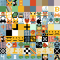
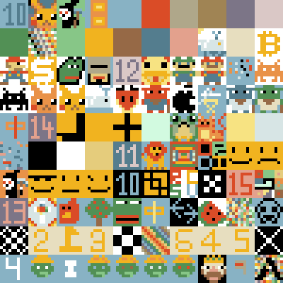
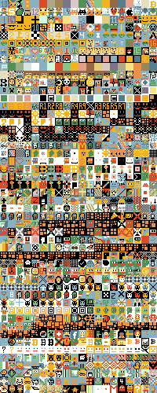
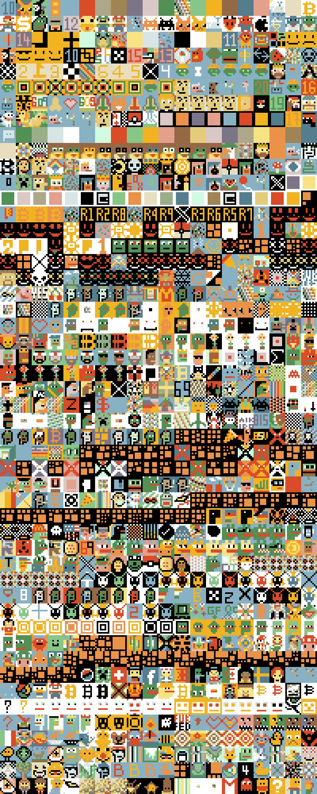

# Bixel  - Bitcoin Ordinal Inscription Pixel (Image) Protocol


## V1 / Chapter 1 / OG   - 7x7 canvas / 10 colors

- 7x7 canvas (=49 pixels)
- 10 colors (0-9)
  -  0 => #434a41 / rgb( 67  74  65) - hsl(107°   6%  27%)
  -  1 => #689579 / rgb(104 149 121) - hsl(143°  18%  50%)
  -  2 => #cdd995 / rgb(205 217 149) - hsl( 71°  47%  72%)
  -  3 => #e7debf / rgb(231 222 191) - hsl( 47°  45%  83%)
  -  4 => #e5cc7c / rgb(229 204 124) - hsl( 46°  67%  69%)
  -  5 => #f1b31f / rgb(241 179  31) - hsl( 42°  88%  53%)
  -  6 => #e99248 / rgb(233 146  72) - hsl( 28°  79%  60%)
  -  7 => #da4c27 / rgb(218  76  39) - hsl( 12°  71%  50%)
  -  8 => #dac8c6 / rgb(218 200 198) - hsl(  6°  21%  82%)
  -  9 => #547d8e / rgb( 84 125 142) - hsl(198°  26%  44%)
  


Example - .bixel no. 10 (at inscribe no. 21964036)

```
3113113111111311303011111111117777711111131111333.bixel 
```


Let's use the pixelart machinery to generate the (bitmap) image 
from the paint by number spec.


``` ruby
require 'pixelart'

## step 1 - define the paint by number color mapping
COLORS = {
        '0': '#434a41', 
        '1': '#689579', 
        '2': '#cdd995', 
        '3': '#e7debf', 
        '4': '#e5cc7c', 
        '5': '#f1b31f', 
        '6': '#e99248', 
        '7': '#da4c27', 
        '8': '#dac8c6', 
        '9': '#547d8e'
}  

## step 2 - generate the bitmap image / parse the spec
img = Image.parse( '3113113111111311303011111111117777711111131111333'
                   colors: COLORS,
                   width: 7, 
                   height: 7 ) 
img.save( "./bixel10.png" )
img.zoom(8).save( "./bixel10@8x.png" )
```

Voila!


in 8x


Bonus:  Let's define a ready-to-use Bixel Image class.

```ruby
module Bixel
  # 7x7 canvas (49 pixels) -  10 colors (0-9)
  WIDTH  = 7
  HEIGHT = 7      
  COLORS = {
        '0': '#434a41', 
        '1': '#689579', 
        '2': '#cdd995', 
        '3': '#e7debf', 
        '4': '#e5cc7c', 
        '5': '#f1b31f', 
        '6': '#e99248', 
        '7': '#da4c27', 
        '8': '#dac8c6', 
        '9': '#547d8e'
  }    
  class Image < Pixelart::Image
     def self.parse( pixels )
        super( pixels, colors: COLORS, 
                       width:  WIDTH,
                       height: HEIGHT)
     end
  end # class Image
end # module Bixel
```


and let's retry:

``` ruby
img = Bixel::Image.parse( '3113113111111311303011111111117777711111131111333' ) 
img.save( "./bixel10.png" )
img.zoom(8).save( "./bixel10@8x.png" )
```

Voila!


in 8x


Let's try some more.
[Search for bixel](https://unisat.io/search?q=bixel&type=text) via unisat.


```ruby
bixels = [
  [32,'0060000066660000600600066600006006006666000060000'],  # Bixel #32 - Inscribe #22140448
  [43,'0055500055555055050555555555550005606555600066600'],  # Bixel #43 - Inscribe #22140536
  [50,'9994999984548994575499845489988488998818899991999'],  # Bixel #50 - Inscribe #22140557
  [86,'8899988889998899999998888888889898888878888999998'],  # Bixel #86 - Inscribe #22141494
  [90,'0000000000100000110000001000000100000111000000000'],  # Bixel #90 - Inscribe #22141738
  [153,'0777777077777707777770777777077777707700000770000'], # Bixel #153 - Inscribe #22159765
  [163,'3795793951116551010177117119311111333101333311133'], # Bixel #163 - Inscribe #22159775
  [298,'0000000077077007070700700070007070000070000000000'], # Bixel #298 - Inscribe #22160168
  [405,'7777777777777775777575757575577577557777755777775'], # Bixel #405 - Inscribe #22160379
  [432,'0033300033333030030033003003333033303333300030300'], # Bixel #432 - Inscribe #22160466
]

bixels.each do |num,spec|
  img = Bixel::Image.parse( spec ) 
  img.save( "./bixel#{num}.png" )
  img.zoom(8).save( "./bixel#{num}@8x.png" )
end
```

resulting in:


in 8x


## V2 / Chapter 2   - 10x10 canvas / 21 colors

- 10x10 canvas (=100 pixels)
- 21 colors (A-U)
  -  A => #88b2c4 / rgb(136 178 196) - hsl(198°  34%  65%)
  -  B => #547d8e / rgb( 84 125 142) - hsl(198°  26%  44%)
  -  C => #dac8c6 / rgb(218 200 198) - hsl(  6°  21%  82%)
  -  D => #7c7587 / rgb(124 117 135) - hsl(263°   7%  49%)
  -  E => #e3a18d / rgb(227 161 141) - hsl( 14°  61%  72%)
  -  F => #da4c27 / rgb(218  76  39) - hsl( 12°  71%  50%)
  -  G => #f1b31f / rgb(241 179  31) - hsl( 42°  88%  53%)
  -  H => #e99248 / rgb(233 146  72) - hsl( 28°  79%  60%)
  -  I => #87c687 / rgb(135 198 135) - hsl(120°  36%  65%)
  -  J => #529055 / rgb( 82 144  85) - hsl(123°  27%  44%)
  -  K => #a08454 / rgb(160 132  84) - hsl( 38°  31%  48%)
  -  L => #966946 / rgb(150 105  70) - hsl( 26°  36%  43%)
  -  M => #e7debf / rgb(231 222 191) - hsl( 47°  45%  83%)
  -  N => #afa78a / rgb(175 167 138) - hsl( 47°  19%  61%)
  -  O => #d2fae0 / rgb(210 250 224) - hsl(141°  80%  90%)
  -  P => #f7e382 / rgb(247 227 130) - hsl( 50°  88%  74%)
  -  Q => #9aaf89 / rgb(154 175 137) - hsl( 93°  19%  61%)
  -  R => #e5cc7c / rgb(229 204 124) - hsl( 46°  67%  69%)
  -  S => #fff / rgb(255 255 255) - hsl(  0°   0% 100%) - WHITE
  -  T => #d7e5e5 / rgb(215 229 229) - hsl(180°  21%  87%)
  -  U => #000 / rgb(  0   0   0) - hsl(  0°   0%   0%) - BLACK


Example - .biixel (at inscribe no. 22237694)

```
UGGLBBBBBLUHGHLBBBLHBLHGHLBBHGBBLHGGGGGHBBLGGGGGGGDDHSUGGGSUDGHUUGGGUUDFFGGGLGGGDFFHGLHLGHDDLHHHHHHH.biixel 
```


Let's use the pixelart machinery to generate the (bitmap) image 
from the paint by letter spec.

Step 1 - let's define a read-to-use Biixel Image class:

``` ruby
module Biixel    
  # 10x10 canvas (100 pixels) - 21 colors (A-U)
  WIDTH  = 10
  HEIGHT = 10
  COLORS = {
    A: '#88b2c4',
    B: '#547d8e',
    C: '#dac8c6', 
    D: '#7c7587',
    E: '#e3a18d', 
    F: '#da4c27',
    G: '#f1b31f',
    H: '#e99248',
    I: '#87c687', 
    J: '#529055',
    K: '#a08454', 
    L: '#966946',
    M: '#e7debf', 
    N: '#afa78a',
    O: '#d2fae0', 
    P: '#f7e382',
    Q: '#9aaf89', 
    R: '#e5cc7c',
    S: '#fff',
    T: '#d7e5e5',
    U: '#000' }

  class Image < Pixelart::Image
    def self.parse( pixels )
      super( pixels, colors: COLORS, 
                     width:  WIDTH,
                     height: HEIGHT)
    end
  end # class Image
end  # module Biixel
```


and step 2 - let's generate the bitmap image / parse the spec:

```ruby
img = Biixel::Image.parse( 'UGGLBBBBBLUHGHLBBBLHBLHGHLBBHGBBLHGGGGGHBBLGGGGGGGDDHSUGGGSUDGHUUGGGUUDFFGGGLGGGDFFHGLHLGHDDLHHHHHHH' )
img.save( "./biixel1.png" )
img.zoom(8).save( "./biixel1@8x.png" )

```

Voila!


in 8x


Let's try some more.
[Search for biixel](https://unisat.io/search?q=biixel&type=text) via unisat.

Let's prepare an (SQL) database with 1000+ inscriptions
matching the 'biixel' full-text search (on unisat)
with all inscribe ids listed in [biixel.csv](biixel.csv).

Let's download the inscriptions (metadata & content) 
via ordinals.com to a local cache (in `/inscription`)
and than import into single-file SQLite database (`ord.db`).

``` ruby
require 'ordlite'

cache = Ordinals::Cache.new( './inscription' )
cache.add_csv( './biixel.csv' )

OrdDb.open( './ord.db' )
cache.import_all

puts
puts "  #{Inscribe.count} inscribe(s)"
puts "  #{Blob.count} blob(s)"
#=>  1024 inscribe(s)
#=>  1024 blob(s)
```


Now let's query for the .biixel inscriptions 
and validate the candidates to filter out broken mints
not matching the pattern `[A-U]{100}.biixel`.


``` ruby
require 'ordlite'

OrdDb.open( './ord.db' )

inscribes = Inscribe.joins( :blob )
                   .where( 'content LIKE ?', '%.biixel%' )
                   .order( 'num' )
                   
puts
puts "  #{inscribes.size} inscribe(s) - unconfirmed candidates"


## validate / filter-out false positives
BIIXEL_RX =  /\A
               [A-U]{100}
               \.biixel
               \z/x

inscribes = inscribes.select do |inscribe|
                if BIXXEL_RX.match( inscribe.text.strip )
                    true
                else  
                    puts "!! WARN - expected [A-U]{100}.biixel inscribe no. #{inscribe.num} @ #{inscribe.date}; got:"
                    puts "  >#{inscribe.text}<"
                    false  
                end
             end

puts
puts "  #{inscribes.size} inscribe(s) - validated"
```

resulting in

```
 1023 inscribe(s) - unconfirmed candidates

!! WARN - expected [A-U]{100}.biixel inscribe no. 22238685 @ 2023-08-08 23:38:58 UTC; got:
  >SUSUSUSUSUUSUSUSUSUUUUSUSUSUUUUUUSUSUUUUUUUUSUUUUUUUUUUSUUUUUUUUSUSUUUUUUSUSUSUUUUSUSUSUSUUSUSUSUSUS.biixel
   FUFUFUFUFUUFUFUFUFUUUUFUFUFUUUUUUFUFUUUUUUUUFUUUUUUUUUUFUUUUUUUUFUFUUUUUUFUFUFUUUUFUFUFUFUUFUFUFUFUF.biixel
   GUGUGUGUGUUGUGUGUGUUUUGUGUGUUUUUUGUGUUUUUUUUGUUUUUUUUUUGUUUUUUUUGUGUUUUUUGUGUGUUUUGUGUGUGUUGUGUGUGUG.biixel
   AUAUAUAUAUUAUAUAUAUUUUAUAUAUUUUUUAUAUUUUUUUUAUUUUUUUUUUAUUUUUUUUAUAUUUUUUAUAUAUUUUAUAUAUAUUAUAUAUAUA.biixel
   UAAAAAAAAUAUAAAAAAUAAAUAAAAUAAAAAUAAUAAAAAAAUUAAAAAAAAUUAAAAAAAUAAUAAAAAUAAAAUAAAUAAAAAAUAUAAAAAAAAU.biixel<
!! WARN - expected [A-U]{100}.biixel inscribe no. 22238686 @ 2023-08-08 23:38:58 UTC; got:
  >biixelFAAAAAAAAFAFAAAAAAFAAAFAAAAFAAAAAFAAFAAAAAAAFFAAAAAAAAFFAAAAAAAFAAFAAAAAFAAAAFAAAFAAAAAAFAFAAAAAAAAF.biixel
   AAAAAAAAAAAAAAAAAAAAAAAAAAAAAAGGGGAAAJJAGAAAAAAJAJGAGGFFFJAJGAAGFAFJAJGGGGFFFJJAAAAAAAAAAAAAAAAAAAAA.biixel
   AAAAAAAAAAAAAAAAAAAAAAAAAAAAAAGGGGAAAUUAGAAAAAAUAUGAGGFFFUAUGAAGFAFUAUGGGGFFFUUAAAAAAAAAAAAAAAAAAAAA.biixel<
!! WARN - expected [A-U]{100}.biixel inscribe no. 22238748 @ 2023-08-09 00:32:25 UTC; got:
  >lFDOBCGAHIEDOBCGAHIEIOBCGAHIEIHBCGAHIEIHACGAHIEIHAGGAHIEIHAGCAHIEIHAGCBHIEIHAGCBOIEIHAGCBODEIHAGCBODF.biixel<
!! WARN - expected [A-U]{100}.biixel inscribe no. 22238957 @ 2023-08-09 00:51:29 UTC; got:
  >啊啊啊啊啊啊啊啊啊啊啊啊啊啊啊啊啊啊啊啊啊啊啊啊啊啊啊啊啊啊啊啊啊啊啊啊啊啊啊啊啊啊啊啊啊啊啊啊啊啊啊啊啊啊啊啊啊啊 啊啊啊啊啊啊啊啊啊啊啊啊啊啊啊啊啊啊啊啊啊啊啊啊啊.biixel<
!! WARN - expected [A-U]{100}.biixel inscribe no. 22250952 @ 2023-08-09 03:05:25 UTC; got:
  >SSSSSSSSSSSSJJQJJSSSSSJJJJJJJSSSGGGGGGSSSSGGBGBFFFSSGGGGGGSSSSGFFFFGSSSSGGGGGGSSSSSGGGSSSSSSSGGGSSSS.biixel
   SSSSSSSSSSSSBBABBBSSSBBBBBBBSSSSIIIIIISSSSIIUIUISSSSIIIIIISSSSIFFFFISSSSIIIIIISSSSSIIISSSSSSSIIISSSS.biixel<
!! WARN - expected [A-U]{100}.biixel inscribe no. 22291179 @ 2023-08-09 03:57:53 UTC; got:
  >WXYZWXYZWXYZWXYZWXYZWXYZWXYZWXYZWXYZWXYZWXYZWXYZWXYZWXYZWXYZWXYZWXYZWXYZWXYZWXYZWXYZWXYZWXYZWXYZWXYZ.biixel<
!! WARN - expected [A-U]{100}.biixel inscribe no. 22345638 @ 2023-08-09 08:00:09 UTC; got:
  >ABJILPEFQMNCDGHRSTUOVWKXYTZBCJKLDFAGMQROPHNTSVWUXEIYLZCJDBLKFAPGMQHSORNTVWIUZXJYLCZBCJKLDFAGMQROPARH.biixel<
!! WARN - expected [A-U]{100}.biixel inscribe no. 22348229 @ 2023-08-09 08:21:55 UTC; got:
  >PUSHFORCHANGEADVENTURESBRINGPERSPECTIVESRESISTTHEOLDSTANDFIRMBELIEVEANDEMBRACEBITCOINORDINALS.biixel<
!! WARN - expected [A-U]{100}.biixel inscribe no. 22350766 @ 2023-08-09 08:37:31 UTC; got:
  >FUCKERSINSCHOOLTELLINGMEALWAYSINTHEBARBERSHOPCHIEFKEEFAINTBOUTTHISCHIEFAINTBOUTTHATMYBOYABDONFUCKING.biixel<
!! WARN - expected [A-U]{100}.biixel inscribe no. 22350767 @ 2023-08-09 08:37:31 UTC; got:
  >TRAPPINOUTTHEBANDOoTRAPPINOUTTHEBANDOoTRAPPINOUTTHEBANDOoTRAPPINOUTTHEBANDOoTRAPPINOUTTHEBANDOoTRAPP.biixel<
!! WARN - expected [A-U]{100}.biixel inscribe no. 22350768 @ 2023-08-09 08:37:31 UTC; got:
  >FUCKGARYGENSLERFUCKGARYGENSLERFUCKGARYGENSLERFUCKGARYGENSLERFUCKGARYGENSLERFUCKGARYGENSLERFUCKTHESEC.biixel<
!! WARN - expected [A-U]{100}.biixel inscribe no. 22350786 @ 2023-08-09 08:37:31 UTC; got:
  >THISISTHEPSYOPTHISISTHEPSYOPTHISISTHEPSYOPTHISISTHEPSYOPTHISISTHEPSYOPTHISISTHEPSYOPTHISISTHEPSYOPTH.biixel<
!! WARN - expected [A-U]{100}.biixel inscribe no. 22351383 @ 2023-08-09 09:05:43 UTC; got:
  >LEADTHEWAYINANERAOFCRISISRESISTTHEOLDSTANDFIRMPROMOTECHANGEANDTRUSTEMBRACEBITCOINORDINALSFIGHTBACKGO.biixel<
!! WARN - expected [A-U]{100}.biixel inscribe no. 22395842 @ 2023-08-09 11:33:44 UTC; got:
  >SATOSHINAKAMOTOSPARKSFIATSLOCKBITCOINSNEWARTBECOMESTHEMONETARYSPARKFIATLOCKSJUMPTOTHEBITCOINLIFERAFT.biixel<
!! WARN - expected [A-U]{100}.biixel inscribe no. 22454744 @ 2023-08-09 17:07:40 UTC; got:
  >BSSPBSSSSABSSSGSBSSSSSSAABSSSSHSSABSSSPSSSSBSSGSSSSSSSSSSSSSSSHSSSSBPSSSSSBB.biixel<
!! WARN - expected [A-U]{100}.biixel inscribe no. 22550033 @ 2023-08-10 10:09:15 UTC; got:
  >AAARAATAAAAAOAAAAQAAAFAAAAAAHAAAAAAAAAAA.biixel<
!! WARN - expected [A-U]{100}.biixel inscribe no. 22591201 @ 2023-08-10 20:43:31 UTC; got:
  >bixel_AAAAAAAAAAAAUUUUUUAAAUTTTTTTUAAUTUFFUTUAAUTFFFFTUAAUTTTTTTUAAAUTMMTUAAAAUTMMTUAAAAAUUUUAAAAAAAAAAAAA.biixel<

  1006 inscribe(s) - validated
```


Last but not least
let's generate the first hundred biixel fam
and the first thousand biixel fam composite all-in-one image.


``` ruby
require 'pixelart'

require_relative 'bixel'

## first hundred in 10x10 grid
composite = ImageComposite.new( 10, 10, width: Biixel::WIDTH,
                                        height: Biixel::HEIGHT )

inscribes[0,100].each do |inscribe|
    txt = inscribe.text
    spec = txt.strip.sub( '.biixel', '' )
    img = Biixel::Image.parse( spec )
    composite << img
end

composite.save( './biixels_100.png' )
composite.zoom(4).save( './biixels_100@4x.png' )


## first thousand in 20x50 grid
composite = ImageComposite.new( 20, 50, width: Biixel::WIDTH,
                                        height: Biixel::HEIGHT )

inscribes[0,1000].each do |inscribe|
    txt = inscribe.text
    spec = txt.strip.sub( '.biixel', '' )
    img = Biixel::Image.parse( spec )
    composite << img
end

composite.save( './biixels_1000.png' )
composite.zoom(4).save( './biixels_1000@4x.png' )
```

resulting in:




in 4x




and



in 4x




To be continued...


## License

The scripts are dedicated to the public domain.
Use it as you please with no restrictions whatsoever.


## Questions? Comments?

Join us in the [Ordgen / ORC-721 discord (chat server)](https://discord.gg/dDhvHKjm2t). Yes you can.
Your questions and commetary welcome.


Or post them over at the [Help & Support](https://github.com/geraldb/help) page. Thanks.
