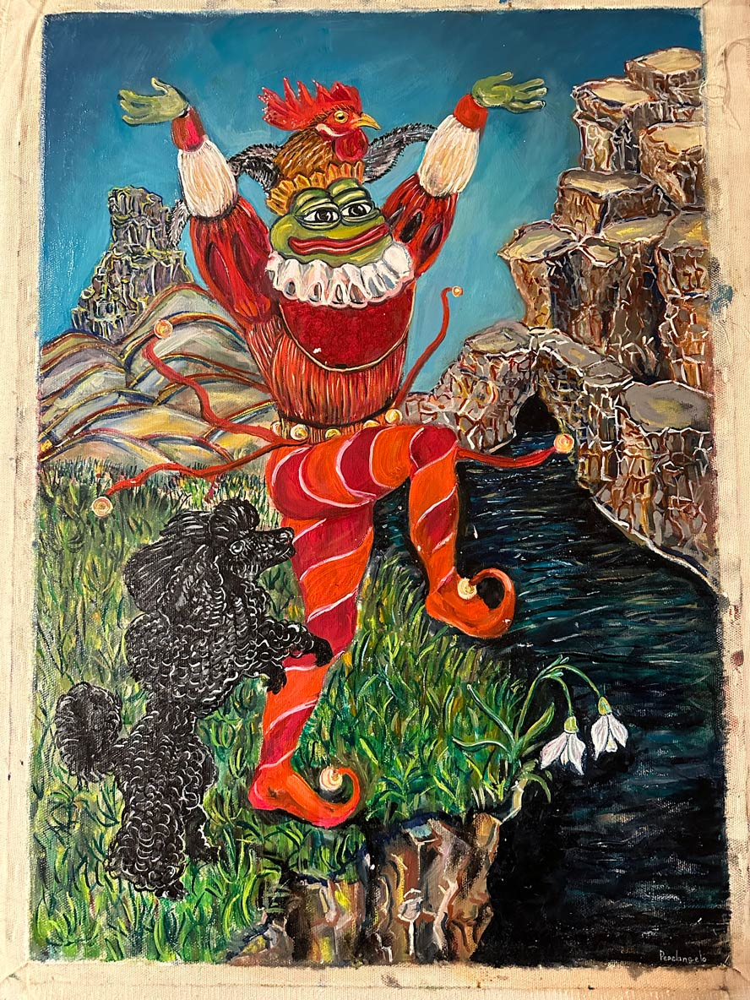
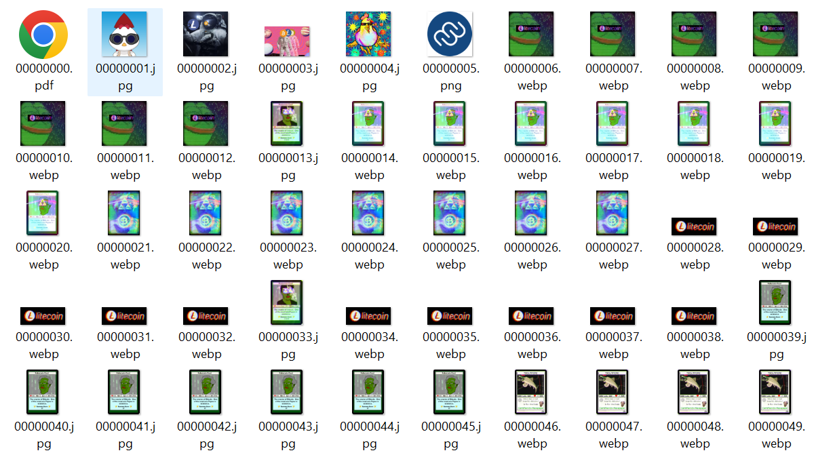

[« Programming (Litecoin) Ordinals - Step-by-Step Book / Guide](./)


# Sub 1k - Inside The First Thousand (Litecoin) Ordinal Inscriptions


Let's explore the first thousand ordinal inscriptions 
from [inscription  №0](https://ordinalslite.com/inscription/71e0f6dc87a473aa69787fff8e09e5eddfdca96e587928a5b1a25c0ae16dc0eei0)
to [inscription №999](https://ordinalslite.com/inscription/aba63632a275ce5c20cb87d0af58c0b11e6f328514e2cf7fecf6132086fd33f8i0).


Looking for the bitcoin (btc) edition? See [Sub 1k - Inside the first thousand bitcoin ordinal inscripitons »](sub1k.md)


## Step 0:  Let's build the sub1k (SQL) database (ordlite / sqlite)

Let's setup and build from scratch / zero 
a single-file SQLite database (e.g. `òrdsub1k.ltc.db`) with
the first thousand ordinal inscriptions, 
that is, all metadata and (content) blobs, that is, images or text or audio or whatever.

To fetch the inscription metadata and content blobs
let's use the ordinalslite.com api wrapper / client, that is,
the [ordinals gem](https://github.com/ordbase/ordbase/tree/master/ordinals). 

To setup and build the SQL schema / tables
and insert (& update) all database records let's use
the ordinals sqlite database helpers & machinery, that is, the [ordlite gem](https://github.com/ordbase/ordbase/tree/master/ordlite).


Let's get started:

``` ruby
require 'ordlite'


OrdDb.open( './ordsub1k.ltc.db' )

puts
puts "  #{Inscribe.count} inscribe(s)"
puts "  #{Blob.count} blob(s)"
#=>   0 inscribe(s)
#=>   0 blob(s)

## IMPORTANT!  switch (block)chain to litcoin / ltc
Ordinals.chain = :ltc 

## import listed inscripiton ids (fetch via ordinals.com api)
OrdDb.import_csv( "./meta/sub1k_inscriptions.csv" )

puts
puts "  #{Inscribe.count} inscribe(s)"
puts "  #{Blob.count} blob(s)"
#=>   1000 inscribe(s)
#=>   1000 blob(s)
```

Show time! Let's run the [`ltc_sub1k_build` script](ltc_sub1k_build.rb) and 
once
all 1000×2, that is, 2000 web (api) requests are processed 
you will have a copy of all sub1k ordinal inscriptions with all metadata and content blobs in a single-file SQLite database (about 160 MB).


## Let's query and analyze the sub1k inscriptions via SQL


Let's try a test run ...

``` ruby
require 'ordlite'


OrdDb.open( './ordsub1k.ltc.db' )

puts
puts "  #{Inscribe.count} inscribe(s)"
puts "  #{Blob.count} blob(s)"
#=>   1000 inscribe(s)
#=>   1000 blob(s)
```


Let's query for the ten biggest (by bytes) inscriptions 
(and pretty print the result):

```ruby
Inscribe.biggest.limit(10).each do |rec|
    print "#{number_to_human_size(rec.bytes)} (#{rec.bytes} bytes) - "
    print "Inscribe №#{rec.num} (#{rec.content_type}) - "
    print "#{rec.date} - #{rec.fee} fee in litoshis"
    print "\n"
end
```

or in vanilla SQL:

``` sql
     SELECT * 
      FROM inscribes 
  ORDER BY bytes DESC 
     LIMIT 10
```

resulting in:

```
387 KB (396340 bytes) - Inscribe №100 (image/webp) - 2023-02-20 19:19:25 - 775291 fee in lits
387 KB (396313 bytes) - Inscribe №89 (image/gif) - 2023-02-20 19:14:53 - 775236 fee in lits
386 KB (395261 bytes) - Inscribe №866 (image/png) - 2023-02-21 06:35:39 - 199016 fee in lits
385 KB (394012 bytes) - Inscribe №291 (image/webp) - 2023-02-20 21:03:48 - 770737 fee in lits
385 KB (394012 bytes) - Inscribe №292 (image/webp) - 2023-02-20 21:03:48 - 770737 fee in lits
385 KB (394012 bytes) - Inscribe №293 (image/webp) - 2023-02-20 21:03:48 - 770737 fee in lits
385 KB (394012 bytes) - Inscribe №294 (image/webp) - 2023-02-20 21:03:48 - 770737 fee in lits
385 KB (394012 bytes) - Inscribe №295 (image/webp) - 2023-02-20 21:03:48 - 770737 fee in lits
385 KB (394012 bytes) - Inscribe №296 (image/webp) - 2023-02-20 21:03:48 - 770737 fee in lits
385 KB (394012 bytes) - Inscribe №297 (image/webp) - 2023-02-20 21:03:48 - 770737 fee in lits
```

Litecoin triva: Did you know? The litoshi is the smallest possible division
and named in homage to bitcoin's smallest denomination 
the satoshi, representing 1⁄100000000 (one hundred millionth) litecoin.


Let's query for all inscriptions grouped by date (day) and dump the results:

```ruby
pp Inscribe.counts_by_date   ## or count_by_day
```

or in vanilla SQL:

```sql
 SELECT strftime('%Y-%m-%d', date) AS day, COUNT(*) 
   FROM inscribes 
  GROUP BY day 
  ORDER BY day
```

resulting in:

```
{"2023-02-19" => 4, 
 "2023-02-20" => 299, 
 "2023-02-21" => 697}
```

Let's query for all content types and group by count (descending) and dump the results:


```ruby
pp Inscribe.counts_by_content_type
```

or in vanilla SQL:

```sql
   SELECT content_type, COUNT(*) 
     FROM inscribes 
 GROUP BY content_type
 ORDER BY COUNT(*) DESC, content_type
```

resulting in:

```
{"image/jpeg" => 397,
 "image/png" => 218,
 "video/mp4" => 200,
 "image/webp" => 109,
 "image/svg+xml" => 50,
 "text/plain;charset=utf-8" => 16,
 "image/gif" => 9,
 "application/pdf" => 1}
```


Let's query for the genesis inscription no. 0 - the mimble wimble whitepaper (6 pages) 
by Tom Elvis Jedusor: 

``` ruby
## get mimble wimble whitpaper (no. 0) pdf document
inscribe = Inscribe.find_by( num: 0 )
write_blob( "./mimblewimble.pdf", inscribe.content )
```


Yes, you can. Learn more about confidental / private transactions with Mimble Wimble:
- [mimblewimble.pdf (56 kb)](https://ordbase.github.io/ordbase/mimblewimble.pdf)

Litecoin triva: Did you know? In May 2022, the Mimblewimble Extension Blocks (MWEB)
upgrade was activated on the Litecoin network as a soft fork - 
providing users with the option of sending confidential / private transactions where the amount sent is only known between the sender and receiver.


Let's try to curate some sub1k image collections.


Let's save all pepelangelo .JPGs in the collection for easy access
using `pepelangelo1.png`, `pepelangelo2.png`, `pepelangelo3.png` up to 
`pepelangelo44.png`.  


```ruby
nums = [
  207, 208, 209,
  210, 211, 212, 213, 214, 215, 216, 217, 218, 219,
  220, 221, 222, 223, 224, 225, 226, 227, 228,
  236, 237, 238, 239,
  240, 241, 242, 243, 244, 245, 246, 247, 248, 249,
  250, 251, 252, 253, 254, 255, 256, 257
]

puts "  #{nums.size} pepelangelo(s)"
#=> 44 pepelangelo(s) 

nums.each_with_index do |num, i|
  inscribe = Inscribe.find_by( num: num )
  write_blob( "./pepelangelo#{i+1}.jpg", inscribe.content )
end   
```

resulting in:




...


Let's save all (ordinal?) punk .PNGs in the collection for easy access
using `punk1.png`, `punk2.png`, `punk3.png` up to 
`punk100.png`.  

```ruby
nums = [
    458, 459, 
    460, 461, 462, 463, 464, 465, 466, 467, 468, 469,
    470, 471, 472, 473, 474, 475, 476, 477, 478, 
    487, 488, 489, 
    490, 491, 492, 493, 494, 495, 496, 497, 498, 499,
    500, 501, 502, 503, 504, 505, 506, 507, 508, 509,
    510, 511, 512, 513, 514, 515, 516, 517, 518, 519,
    520, 521, 522, 523, 
    531, 532, 533, 534, 535, 536, 537, 538, 539,
    540, 541, 542, 548, 549, 
    550, 551, 552, 553, 554, 555, 556, 557, 558, 559,
    560, 561, 562, 563, 564, 565, 566, 567, 568, 569,
    570, 571, 
    580, 581, 582, 583, 584, 585,  
]

puts "  #{nums.size} punk(s)"
#=>  100 punk(s) 


nums.each_with_index do |num, i|
    inscribe = Inscribe.find_by( num: num )
    write_blob( "./punk#{i+1}.png", inscribe.content )
end   
```

resulting in:


...


Bonus: Let's generate an all-in-one fam composite in 1x and 4x.

```ruby
require 'pixelart'

composite = ImageComposite.new( 10, 10, width: 24,
                                        height: 24 )


nums = [
    458, 459, 
    460, 461, 462, 463, 464, 465, 466, 467, 468, 469,
    470, 471, 472, 473, 474, 475, 476, 477, 478, 
    487, 488, 489, 
    490, 491, 492, 493, 494, 495, 496, 497, 498, 499,
    500, 501, 502, 503, 504, 505, 506, 507, 508, 509,
    510, 511, 512, 513, 514, 515, 516, 517, 518, 519,
    520, 521, 522, 523, 
    531, 532, 533, 534, 535, 536, 537, 538, 539,
    540, 541, 542, 548, 549, 
    550, 551, 552, 553, 554, 555, 556, 557, 558, 559,
    560, 561, 562, 563, 564, 565, 566, 567, 568, 569,
    570, 571, 
    580, 581, 582, 583, 584, 585,  
]

nums.each_with_index do |num, i|
    composite << Image.read( "./punk#{i+1}.png" ) 
end

composite.save( "./punks.png" )
composite.zoom(4).save( "./punks@4x.png" )
```


resulting in:


in 4x


Let's query for all text inscribes (with content type `text/plain;charset=utf-8`) 
and print out the text:

```ruby
inscribes = Inscribe.text 
puts "  #{inscribes.size} text inscribe(s)"
#=> 16 text inscribe(s)

inscribes.each_with_index do |rec, i|
  puts "==> [#{i+1}/#{inscribes.size}] text inscribe №#{rec.num} (#{rec.content_type} - #{rec.bytes} bytes):"
  puts  rec.text  
  puts
end
```

resulting in:

```
==> [1/16] text inscribe №400 (text/plain;charset=utf-8 - 2 bytes):
1

==> [2/16] text inscribe №449 (text/plain;charset=utf-8 - 2 bytes):
2

==> [3/16] text inscribe №530 (text/plain;charset=utf-8 - 2 bytes):
2

==> [4/16] text inscribe №914 (text/plain;charset=utf-8 - 10 bytes):
christian

==> [5/16] text inscribe №915 (text/plain;charset=utf-8 - 9 bytes):
litecoin

==> [6/16] text inscribe №916 (text/plain;charset=utf-8 - 2 bytes):
2

==> [7/16] text inscribe №917 (text/plain;charset=utf-8 - 2 bytes):
0

==> [8/16] text inscribe №918 (text/plain;charset=utf-8 - 2 bytes):
3

==> [9/16] text inscribe №919 (text/plain;charset=utf-8 - 2 bytes):
5

==> [10/16] text inscribe №920 (text/plain;charset=utf-8 - 2 bytes):
1

==> [11/16] text inscribe №921 (text/plain;charset=utf-8 - 2 bytes):
4

==> [12/16] text inscribe №923 (text/plain;charset=utf-8 - 2 bytes):
6

==> [13/16] text inscribe №924 (text/plain;charset=utf-8 - 2 bytes):
9

==> [14/16] text inscribe №925 (text/plain;charset=utf-8 - 2 bytes):
7

==> [15/16] text inscribe №926 (text/plain;charset=utf-8 - 2 bytes):
8

==> [16/16] text inscribe №970 (text/plain;charset=utf-8 - 14 bytes):
Buy #Litecoin
```

No quotes, cyber philosophy manifestos, collection manifests, or super sekretoo nuclear launch codes found in the text inscribes.
See the bitcoin (btc) edition [Sub 1k - Inside the first thousand bitcoin ordinal inscripitons](sub1k.md) for more fun.


To be continued...


## Bonus - Let's export (save as ...) all inscriptions content blobs

Let's export (save as ...) all inscription content blobs
to local files with (mime) content types mapped
to file extensions (e.g. `image/png` to `.png`, `text/plain` to `.txt`, and so on)
and use the the inscription number as its filename 
(for easy sorting padded with eight zeros e.g. `0` to `00000000`, `1` to `00000001`) ...


``` ruby
require 'ordlite'

OrdDb.open( './ordsub1k.ltc.db' )

Inscribe.all.each do |rec|
  print "==> exporting inscribe №#{rec.num} "
  print ">#{rec.content_type}< #{number_to_human_size(rec.bytes)} (#{rec.bytes} bytes) " 
  print "to >#{rec.export_path}<..."
  print "\n"
  rec.export   ## gets saved to ./tmp/<num>.<ext> by default
end
```

resulting in:

```
==> exporting inscribe №0 >application/pdf< 55.9 KB (57237 bytes) to >./tmp/00000000.pdf<...
==> exporting inscribe №1 >image/jpeg< 147 KB (150529 bytes) to >./tmp/00000001.jpg<...
==> exporting inscribe №2 >image/jpeg< 86.2 KB (88223 bytes) to >./tmp/00000002.jpg<...
==> exporting inscribe №3 >image/jpeg< 359 KB (367218 bytes) to >./tmp/00000003.jpg<...
==> exporting inscribe №4 >image/jpeg< 57 KB (58398 bytes) to >./tmp/00000004.jpg<...
==> exporting inscribe №5 >image/png< 4.95 KB (5067 bytes) to >./tmp/00000005.png<...
==> exporting inscribe №6 >image/webp< 359 KB (367128 bytes) to >./tmp/00000006.webp<...
==> exporting inscribe №7 >image/webp< 359 KB (367128 bytes) to >./tmp/00000007.webp<...
==> exporting inscribe №8 >image/webp< 359 KB (367128 bytes) to >./tmp/00000008.webp<...
==> exporting inscribe №9 >image/webp< 359 KB (367128 bytes) to >./tmp/00000009.webp<...
...
==> exporting inscribe №998 >image/jpeg< 89.3 KB (91426 bytes) to >./tmp/00000998.jpg<...
==> exporting inscribe №999 >image/jpeg< 89.3 KB (91426 bytes) to >./tmp/00000999.jpg<...
```


or if you look in your `./tmp` directory (depending on your operating system):




## Questions? Comments?

Join us in the [Ordgen / ORC-721 discord (chat server)](https://discord.gg/dDhvHKjm2t). Yes you can.
Your questions and commetary welcome.


Or post them over at the [Help & Support](https://github.com/geraldb/help) page. Thanks.

